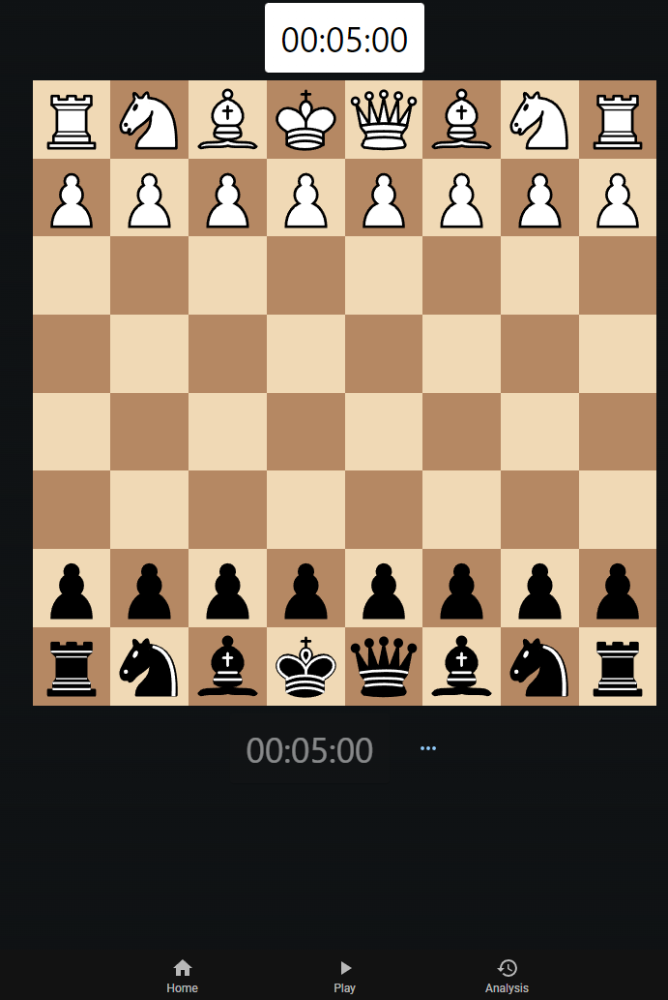

# Qchess

A chess network for playing and analysis powered by stockfish in your web browser.

**🔥 Available at [https://qchess.squidwock.com/](https://qchess.squidwock.com/) 🔥**

# Tech

* [/ws](/ws) Chess backend -> Crowcpp
* [/web](/web) Middleware and frontend -> Next js + prisma + mui
* [/stockfish.wasm](/stockfish.wasm) -> Emscipten + stockfish
* [/reverse-proxy](/reverse-proxy) -> Nginx

# Screenshots

